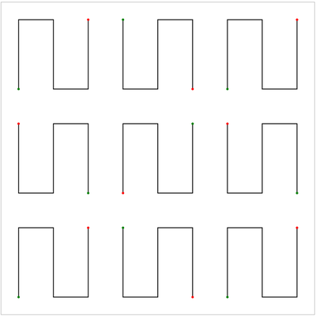

# The Peano Curve

## Introduction
I was looking at this curve and tried to discover how the iterations were built. This was a bit of a mystery. I saw
approximately where the similarities were, but the sizes didn't add up. This is best seen using images.

## The shape repeats
The image below shows the starting situation ("iteration zero").


The image below shows the first iteration.


When fitting a resized image of "iteration zero", there seems to be missing certain portions. Have a look at the image
below. The image from "iteration zero" is resized, colored red with transparency and  superimposed over the first iteration.


When marking the missing parts red, the image below emerges.


When these parts are left out, one can easily see the pattern of "iteration zero" repeating, albeit in different orientation.


By marking the begin and end points with a green dot (start) and red dot (end), the pattern becomes even better visible.



So there are 4 configurations:
1. start at the bottom-left corner and draw up/right
2. start at the bottom-right  corner and draw up/left
3. start at the top-left corner  and draw down/right
4. start at the top-right  corner and draw down/left

## Pattern detection
But how is this pattern created?  After some research the shape is created using a simple question: 
> How can a line be drawn in an matrix of 3 times 3 cells, touching all cells while creating the shortest path?

The answer is simple and is displayed in the image below for one of the configurations as mentioned above.


Assigning letters to each rectangle makes it easier to work with. 


In this case the shape starts at cell `A` and ends at cell `G`. Notice how the shape is drawn using the center of each
of the cells. Now imagine that the next shape is positioned above the first one. See the image below. The first shape
is in the green rectangle, the second is in the blue rectangle. Notice the start and end points being marked with the
green (start) and red (end) circles. The second shape starts at cell `I`.


Now it is clear that we need a connection between cell `G` (green rectangle) and cell `I` in the blue rectangle.

## Dividing the canvas for *n* iterations
When we have a certain canvas (or plane) that we want to use for e.g. 4 iterations, we need to understand how to divide
the plane in rectangles. For every iteration the plane is divided in 9 rectangles:


The first iteration generates the green rectangles. The second iteration generates the blue rectangles. The third iteration
generates the yellow rectangles. Notice, this is just to get the idea. When the third iteration is viewed we get all
yellow rectangles:


So to calculate how many rectangles need to be calculated the following formula is used:

$ f(n) = 3^n $

So for iteration 4 we calculate the fourth power of 3 = 3*3*3*3 = 81 rectangles. 

## The algorithm
Now we understand how the shapes must be layed out, we can construct an algorithm in pseudo code:
```text
  divide the given plane in rectangles
  start bottom/left corner
  
  set $direction = UP
  set $variant = RIGHT
  
  for each $col in columns
    repeat
      draw curve ($row, $col, $direction, $variant)
      switch $variant
      $row = next row using $direction
    until $row is valid
    switch $direction
  next $col
```

**Explanation:**
The trick is to follow the path:
> up -> right -> down -> right -> up -> right -> down -> right -> up

etcetera. Have a look at the function `draw` in the file `index.js`. There is some clutter there due to all the drawing
options, but the basics are clearly visible.